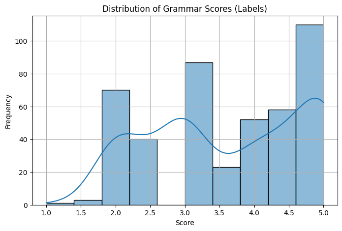
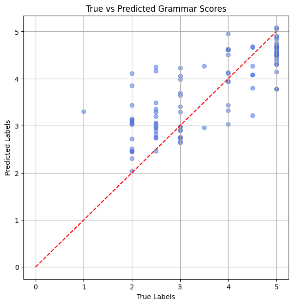

# Speech-Based Grammar Score Prediction

## Overview
This repository contains a hybrid solution for predicting grammar scores from speech audio files. Our model leverages both deep acoustic representations and rich linguistic features to assess the grammatical quality of spoken English. The approach combines pre-trained deep features from the Whisper model with handcrafted acoustic features and text embeddings from a SentenceTransformer, along with audio duration as an additional cue. All these features are merged into one feature vector that is used for regression to predict scores on a scale from 1 (poor grammar) to 5 (excellent grammar).

## Problem Statement
The goal of this project is to develop a system that can automatically evaluate the grammatical correctness of spoken English. Given an audio recording, the system must predict a continuous grammar score between 1 and 5.

## Dataset
The dataset consists of WAV audio recordings along with their corresponding grammar scores. The data is divided into:
- **Training Set:** Audio files with known grammar scores.
- **Test Set:** Audio files for which the grammar score needs to be predicted.

*Dataset available on Kaggle.*

## Methodology
Our hybrid approach combines multiple sources of information into a unified feature vector:
- **Deep Acoustic Features:**  
  We extract a deep acoustic representation using Whisper’s encoder. The model processes the log-Mel spectrogram of the audio and outputs a hidden-state sequence that is averaged over time.
  
- **Handcrafted Acoustic Features:**  
  Acoustic features such as MFCC means and standard deviations, zero crossing rate statistics, and RMS energy features are computed using librosa.
  
- **Linguistic (Text) Features:**  
  The audio is transcribed using Whisper, and the transcript is encoded via a SentenceTransformer to capture semantic information.
  
- **Duration:**  
  The length of the audio (in seconds) is computed and added as a scalar feature to further inform the regression model about the content.

All these features are concatenated into a single hybrid feature vector. A regression model (e.g., XGBoost or an MLP regressor) is then trained on these combined features to predict the final grammar score.

## Implementation Details
- **Feature Extraction:**  
  The pipeline extracts:
  - A deep acoustic embedding from the Whisper encoder.
  - Handcrafted features (MFCCs, zero crossing rate, RMS) using librosa.
  - A text embedding from the transcription via SentenceTransformer.
  - The duration of the audio file.
  
  These are concatenated into one comprehensive feature vector.

- **Model Training and Inference:**  
  The combined features are split into training and validation sets to train a regressor. Post-processing steps such as clipping and smoothing (to adjust predictions within the valid range and match training distribution) are applied before generating the final submission file.

## Results

The hybrid approach showed strong performance on the validation set. Note that the public leaderboard is calculated on approximately 30% of the test data—final standings may vary when evaluated on the full test set.

| Approach | Local Validation Score | Public Leaderboard Score |
| ----------------------- | ----------------- | --------------------------------- |
| Hybrid Ensemble Method  | 0.94       | 0.834*                            |
| Ensemble Mean | 0.7208 | 0.691* |
| Best Fold (Fold 3) | 0.7364 | 0.698* |

\* *Scores are subject to change as the final results will be based on the remaining 70% of test data.*

## Visualizations

### True vs Predicted Grammar Scores


### Distribution of Grammar Scores (Labels)



## Future Work
Potential improvements include:
- Enhanced test-time augmentation techniques (e.g., speed perturbation, pitch shifting).
- Advanced pooling strategies (like attention-based pooling instead of simple mean pooling).
- Refinement of calibration methods (e.g., quantile calibration).
- Exploring alternative architectures (e.g., XLS-R or full Whisper embeddings).
- Integration of additional features or external data sources.

## Contact
For any questions or further discussion regarding this hybrid approach, please feel free to contact me.

-  Colab Link : [Hybrid Approach](https://colab.research.google.com/drive/1w_JI9Xp2Ajw2cTwplGG3X1p9pOk3IDBg?usp=sharing) 

*Note: This repository contains the hybrid ensemble approach. If you are interested in another variant, please reach out directly.*

## Author

Implemented by [Belo Abhigyan](https://github.com/koachgg)

## License

This project is licensed under the MIT License - see the LICENSE file for details.
```


```
